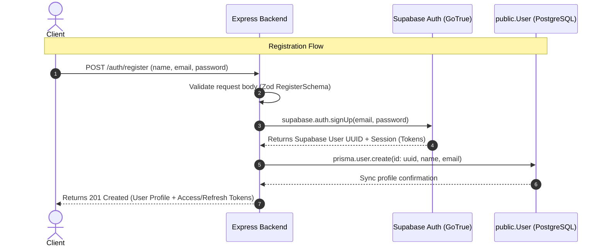
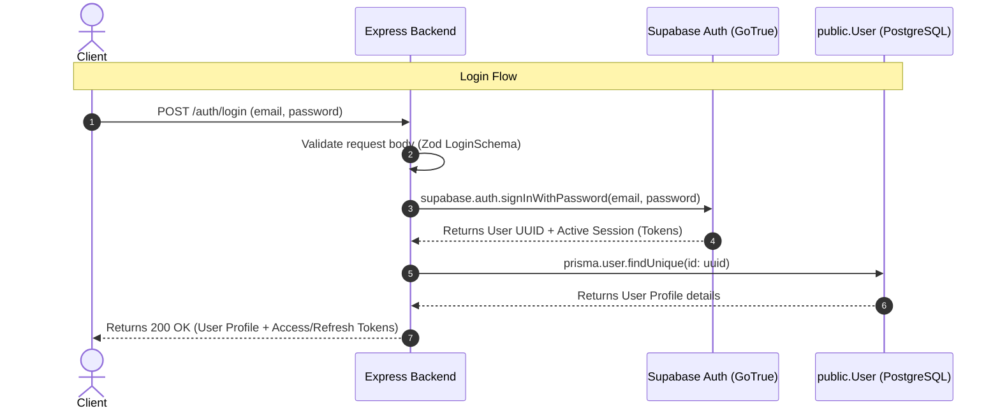
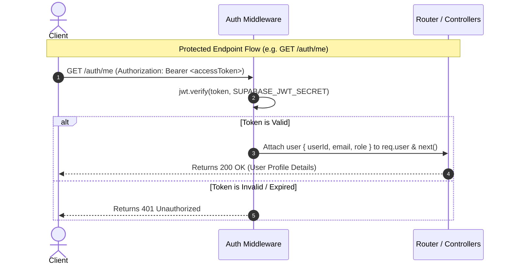

# InterviewAI - Fullstack AI Interview Preparation Platform

InterviewAI is an AI-powered technical interview preparation web application. This repository contains the backend and frontend components.

---

## Repository Structure

- **[backend/](file:///d:/DUCAT%20videos/web%20development/interviewprep-ai/backend/)**: Express.js, TypeScript, Prisma ORM, and Supabase PostgreSQL server.
- **[frontend/](file:///d:/DUCAT%20videos/web%20development/interviewprep-ai/frontend/)**: React / Next.js client-side application.

---

## Authentication Flow Architectures (Supabase Auth)

The Authentication Module is powered by **Supabase Auth** (email/password) and synchronized with our PostgreSQL database via **Prisma ORM**.

### 1. User Registration Flow
When a user signs up, their account credentials are securely handled by Supabase Auth, and their profile is synchronized to the public `User` table via Prisma.



### 2. User Login Flow
Authenticates the user's password directly against Supabase's secure Auth server and retrieves their profile details from the public database.



### 3. JWT Middleware Verification (Protected Routes)
Validates access tokens locally (offline) by verifying the JWT signature using the Supabase project's `JWT_SECRET`, avoiding API rate limits and network hops.



---

## Backend Directory Map

```text
backend/
├── prisma/
│   ├── schema.prisma      # Prisma schema file
│   └── migrations/        # Database migrations log
├── src/
│   ├── config/
│   │   ├── env.ts         # Environment variable validation schema (Zod)
│   │   ├── prisma.ts      # Prisma Client Singleton configuration with PG Pool
│   │   └── supabase.ts    # Configured Supabase clients (Public and Admin)
│   ├── middleware/
│   │   └── auth.middleware.ts # Decodes & validates Supabase JWTs locally
│   ├── modules/
│   │   └── auth/
│   │       ├── auth.controller.ts # Handlers for validating and resolving requests
│   │       ├── auth.service.ts    # Core auth logics (Supabase signs + sync DB)
│   │       ├── auth.repository.ts # Database profiles operations (Prisma)
│   │       ├── auth.routes.ts     # Routes endpoints mapping
│   │       ├── auth.validator.ts  # Zod schema validators
│   │       └── auth.types.ts      # Auth module interfaces and DTOs
│   ├── utils/
│   │   └── response.ts    # Centralized custom JSON response formatters
│   ├── app.ts             # Express setup and central error handler
│   └── server.ts          # Application entry bootstrap
├── .env                   # Local configuration variables
├── tsconfig.json          # Strict TypeScript compiler options
└── package.json           # Installed node modules and configurations
```

---

## API Endpoints Reference

| Endpoint | Method | Headers | Body Format (JSON) | Description |
| :--- | :--- | :--- | :--- | :--- |
| `/auth/register` | `POST` | None | `{ name, email, password, role? }` | Register a new user |
| `/auth/login` | `POST` | None | `{ email, password }` | Authenticate credentials and login |
| `/auth/refresh` | `POST` | None | `{ refreshToken }` | Refresh expired access tokens |
| `/auth/logout` | `POST` | `Authorization: Bearer <token>` | None | Invalidate current user sessions |
| `/auth/me` | `GET` | `Authorization: Bearer <token>` | None | Retrieve user profile metadata |
